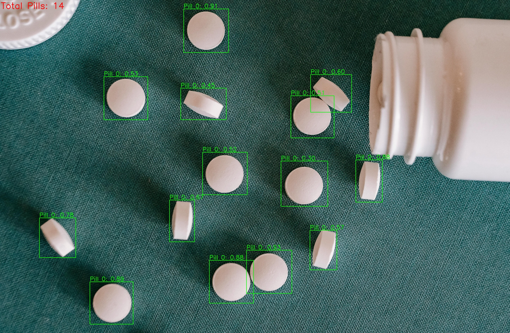

# Pill-detection
Pill detection using `YOLOv26` and counting system for images and videos with efficient inference using `ONNX`.

<p align="center">
  
</p>

---

## **Project Overview**

This project provides:

- Training on a custom pill dataset
- Detection and counting of pills in images and videos
- Efficient inference with PyTorch
- Exporting trained models to ONNX
- Clear code and documentation for running on new data

---

## **Installation**

1. Clone the repository:

```bash
git clone https://github.com/asmabrazi/Pill-detection.git
cd Pill-detection
```

2. Install the requirements:
```bash
pip install -r requirements.txt
```

---

## **Data**
The [`Pills Detection Custom dataset`](https://universe.roboflow.com/sugans-workspace-q0z2l/pills-detection-custom) includes 1804 training images and 135 validation images, 78 test images. After downloading the dataset, unzip it into the `data/` folder in the root of the repository so your structure looks like this:

```bash
data
└── pills-detection-custom.v1i.yolo26
    ├── train
    ├── valid
    ├── test
    ├── README.dataset.txt
    ├── README.roboflow.txt
    └── data.yaml # Dataset configuration file
└── test_images
└── test_videos
```

---

## **Training the Model**
Run the training script with custom arguments:

```bash
python src/train.py \
    --data_path "data/medical-pills/medical-pills.yaml" \
    --model_path "yolo26n.pt" \
    --epochs 100 \
    --device "cuda" \
    --enable_export
```

---

## **Evaluation**
```bash
python src/eval.py --model_path "models/best.pt" --data_path "data/pills-detection-custom.v1i.yolo26/data.yaml" --device "cuda"
```

---

## Performance Summary (Medical Pills Dataset)
The model achieved strong performance on the validation set, demonstrating reliable pill detection: 

| Metric | Score | Key Takeaway |
| :--- | :--- | :--- |
| **mAP@50** | **87.3%** | Excellent localization precision. |
| **mAP@50-95** | **55.0%** | Overall detection performance across stricter IoU thresholds. |
| **Precision** | **86.1%** | High accuracy; relatively few false positives. |
| **Recall** | **78.3%** | Successfully detected most capsues and tablets in validation images. |
| **Fitness** | **68.9%** | Combined metric used for early stopping and model selection. |

---

## **Inference and Pill Counting**
### Image inference:
You can run the pill detector on a single image, and it will detect all pills, draw bounding boxes, and display the total count.

1. Download a [test image](https://www.pexels.com/photo/set-of-small-pills-on-green-surface-5699524/) from Pexels and save it into `data/test_images`
2. Run inference and counting:
```bash
python src/infer_image.py \
    --image_path data/test_images/pexels-alex-green-5699524.jpg \
    --model_path models/best.pt \
    --show
```

---

### Video inference:
You can run pill detection on a video using the inference script:

```bash
python src/infer_video.py --input_path 'data/test_videos/video_1.mp4' --model_path "models/best.onnx"
```

For demonstration, 2 videos are tested: [Video 1](https://www.youtube.com/shorts/K9aHJDOA2_g) and [Video 2](https://www.youtube.com/shorts/V7zem1UBKy4). The detection results are saved in the `test_videos/` folder.  
